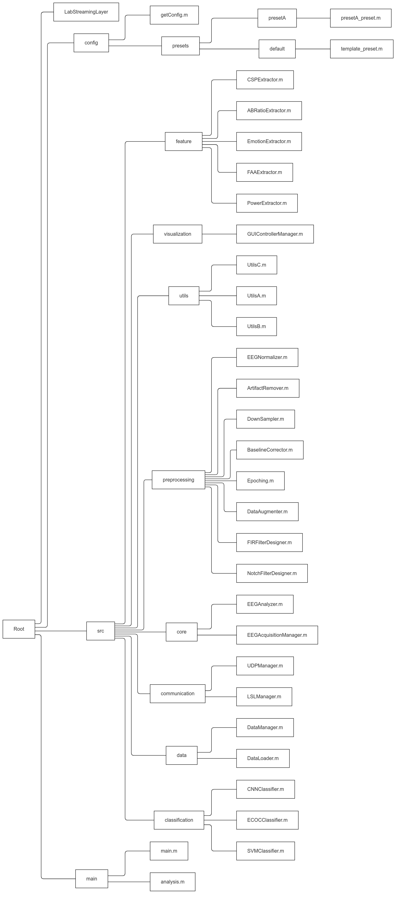
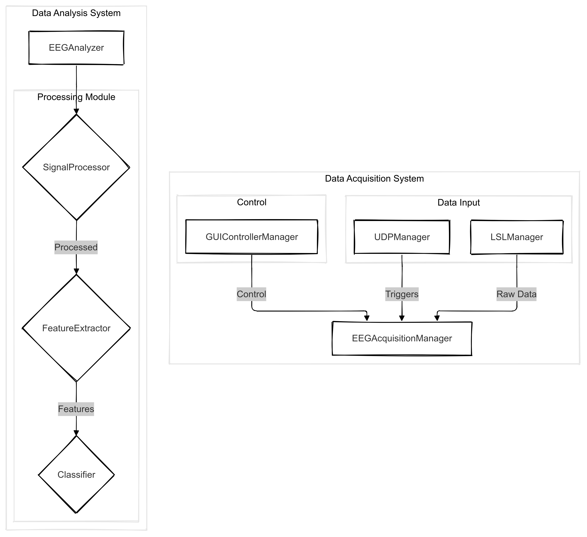

# BCI System Documentation

## 概要
このBCIシステムは、脳波(EEG)データの収集、処理、分析を行うための総合的なフレームワークです。オブジェクト指向設計に基づいて実装されており、高い拡張性と柔軟性を備えています。

## システム構成
システムは以下のような階層構造で構成されています：



システムは大きく分けて以下の2つのサブシステムで構成されています：

1. データ収集システム (Data Acquisition System)
2. データ分析システム (Data Analysis System)



## フォルダ構造

### /config
設定ファイルを管理するディレクトリです。

- `/presets`: 異なる実験設定用のプリセットファイルを格納
  - `template_preset.m`: 基本設定テンプレート
  - その他のプリセットファイル
- `getConfig.m`: 設定読み込み用関数

### /src
ソースコードを格納するメインディレクトリです。

#### /classification
分類器関連のクラスを格納します。
- `CNNClassifier.m`: 畳み込みニューラルネットワーク分類器
- `ECOCClassifier.m`: Error-Correcting Output Codes分類器
- `SVMClassifier.m`: サポートベクターマシン分類器

#### /communication
通信関連のクラスを格納します。
- `LSLManager.m`: Lab Streaming Layer通信管理
- `UDPManager.m`: UDP通信管理

#### /core
システムのコアとなるクラスを格納します。
- `EEGAcquisitionManager.m`: データ収集管理
- `EEGAnalyzer.m`: データ分析管理

#### /data 
データ管理関連のクラスを格納します。
- `DataManager.m`: データの保存・読み込み管理
- `DataLoader.m`: データローダー

#### /feature
特徴抽出関連のクラスを格納します。
- `PowerExtractor.m`: パワースペクトル特徴抽出
- `FAAExtractor.m`: 前頭部α波非対称性特徴抽出
- `ABRatioExtractor.m`: α波/β波比率特徴抽出
- `CSPExtractor.m`: Common Spatial Pattern特徴抽出
- `EmotionExtractor.m`: 感情状態特徴抽出

#### /preprocessing
前処理関連のクラスを格納します。
- `ArtifactRemover.m`: アーティファクト除去
- `BaselineCorrector.m`: ベースライン補正
- `DataAugmenter.m`: データ拡張
- `DownSampler.m`: ダウンサンプリング
- `EEGNormalizer.m`: 信号正規化
- `Epoching.m`: エポック化
- `FIRFilterDesigner.m`: FIRフィルタ設計
- `NotchFilterDesigner.m`: ノッチフィルタ設計

#### /utils
ユーティリティ関数を格納します。
- 各種ヘルパー関数
- 共通で使用する機能

#### /visualization
可視化関連のクラスを格納します。
- `GUIControllerManager.m`: GUI制御管理

### /main
メインスクリプトを格納します。
- `analysis.m`: オフライン分析用メインスクリプト
- `main.m`: オンライン処理用メインスクリプト

## 使用方法

### 1. 初期セットアップ
1. MATLABをインストール（R2019b以降推奨）
2. 必要なツールボックスをインストール：
   - Signal Processing Toolbox
   - Statistics and Machine Learning Toolbox
   - Deep Learning Toolbox（CNNClassifier使用時）

### 2. LSLのセットアップ
1. LabStreamingLayerをインストール
2. パスを設定

### 3. 基本的な使用手順
1. プリセット設定の選択または作成
```matlab
params = getConfig('epocx', 'preset', 'template');
```

2. データ収集モード（オンライン処理）
```matlab
manager = EEGAcquisitionManager(params);
```

3. データ分析モード（オフライン分析）
```matlab
analyzer = EEGAnalyzer(params);
analyzer.analyze();
```

## カスタマイズ方法

### プリセットの作成
1. `template_preset.m`をコピーして新しいプリセットを作成
2. 必要なパラメータを修正
3. `/config/presets`に保存

### 新しい特徴抽出器の追加
1. `/feature`に新しいExtractorクラスを作成
2. 基本インターフェースを実装
3. `EEGAnalyzer`に統合

### 新しい分類器の追加
1. `/classification`に新しいClassifierクラスを作成
2. 基本インターフェースを実装
3. `EEGAnalyzer`に統合

## トラブルシューティング

### よくある問題と解決方法
1. LSL接続エラー
   - LSLライブラリのパスを確認
   - ストリーム名が正しく設定されているか確認

2. メモリ不足エラー
   - バッファサイズを調整
   - 不要なデータを適宜クリア

3. 分類精度が低い
   - 前処理パラメータを調整
   - 特徴抽出方法を見直し
   - トレーニングデータの質を確認

## 注意事項
- リアルタイム処理時は処理負荷に注意
- 大容量データ処理時はメモリ管理に注意
- 実験データは定期的にバックアップを推奨
